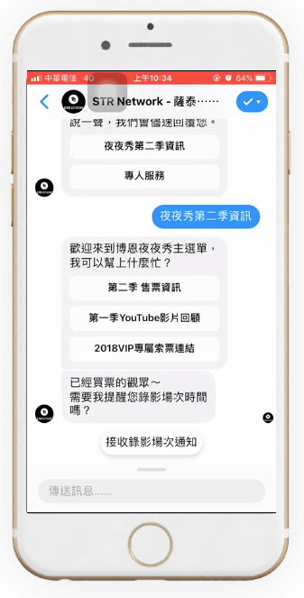
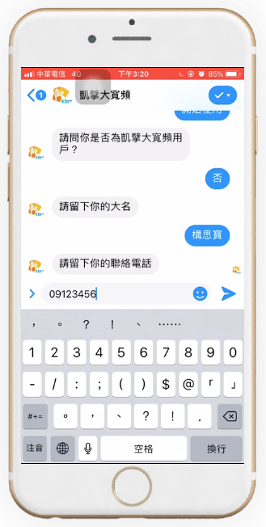

# 什麼是Chatbot

聊天機器人(又稱Chatbot)，能夠經由對話或文字與用戶進行交談，透過人工智慧針對使用者輸入的問題、指令，提供相對應的回覆。

# 聊天機器人是如何與使用者互動？

大致可以分為兩類：問答式介面、按鈕式介面。

## 按鈕式介面

透過聊天機器人內建置的預設腳本內容，供使用者選擇。 相較於問答式互動，按鈕式互動提供明確的選擇方向，在使用者開始使用聊天機器人時，避免陷入茫然不知從何開始的窘境。適合電商、零售、媒體產業**運用在：商品介紹、店點查找、文章查詢、引導下載APP**等。

 [Youtube](https://youtu.be/5IlIVZtoeuc)

## 問答式介面

依據使用者輸入內容，透過自然語意分析(Natural Language Processing, NLP) 與設定的關鍵字回覆使用者。適合金融、汽車、房地產、補教等產業**運用在：獲得潛在客戶名單(Leads generation)、問卷調查、抽獎等情境。**

 [Youtube](https://youtu.be/ryN6EBbZJi4)

# Chatbot實現對話商務的4項建議

Chatbot的應用橫跨各大產業，企業在數位轉型的浪潮下都躍躍欲試，Chatbot的建置過程會遇到什麼挑戰？如何從降低成本轉而用Chatbot來創造需求，甚至設計出對話商務的應用？

## 建議1 開發Chatbot也需要跨部門合作，更要善用80/20原則

80%的人會詢問的常見問題，只占了所有問題的20%，因此只要有能力回答這20％問題的Chatbot就足以發揮效果。企業可以將**基本、重複性的問題交給Chatbot，複雜的問題留給人處理**，此外，Chatbot也需要專業人員的維護，負責處理收到的問題，持續修改Chatbot的流程，有新的資訊也要即時地加入系統。

## 建議2 從降低成本轉而可以提升價值

以往企業導入Chatbot的動機是降低成本，常見的應用是客服中心，但現在許多企業開始要用Chatbot來提升價值、增加營收，也因數位轉型熱潮，想用來開發新的應用型態。

## 建議3 可用Chatbot收集更多APP看不見的數據

相較於APP，其實Chatbot能夠收集更多的使用者數據，若客戶對Chatbot說**我老婆說要換車**，光是一句話就隱含著許多資訊，系統能根據這句話判斷出此**客戶是男性、已婚、目前有車，透過對話的方式得到更多客戶的特徵值（Feature），讓企業能夠更了解客戶，進而當作行銷的參考依據。**

## 建議4 掌握上下文脈絡創造連續式對話商務

掌握對話管理也能為企業帶來新的商機，像是用戶若**詢問其他城市的天氣，Chatbot可以推測用戶要去該地旅遊，就能推薦該信用卡的交通和住宿優惠資訊**，讓對話式商務不再是只處理客戶當下單一的問題，也能結合行銷來建立連續式的商務機會。

# 參考文獻

 * [GoSky](https://www.goskyai.com/tw/)

 * [數位時代](https://www.bnext.com.tw/search/tag/Chatbot)
 
 * [【業界Chatbot開發經驗】靠Chatbot實現對話商務的4項建議](https://www.ithome.com.tw/news/113440)
